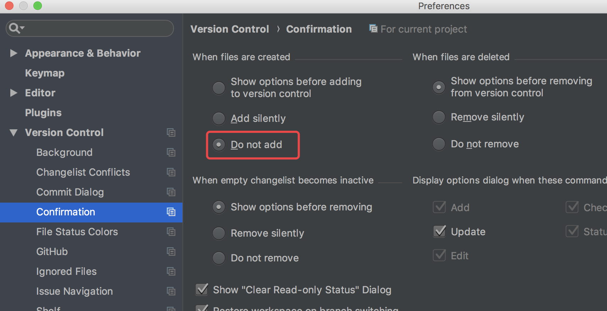

本地已有工程,连接到github新工程  
create a new repository on the command line  
echo "# CppLearning" >> README.md  
git init  
git add README.md  
git commit -m "first commit"  
git remote add origin https://github.com/JimmyKent/GitCommand.git  
git push -u origin master  

### git不自动添加
  